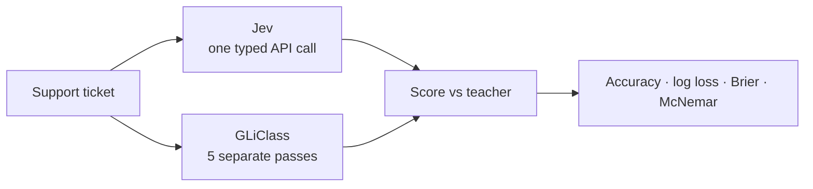

# jev-gliclass-bench

**TypeSafe Jev** vs **Knowledgator GLiClass** on the same customer-service decisions.

Same tickets. Same questions. Same teacher labels. Open numbers.

[](LICENSE)
[](https://huggingface.co/datasets/LocalLLaMA/typed-decisions)
[](results/customer_service_n100_seed42/)

<p align="center">
  
</p>

> **Plain English:** we give both systems the same support tickets and ask things like
> “how urgent?” and “does a human need to step in?”. We score how often each matches
> the dataset’s teacher answers. Jev lands around **78%**; this GLiClass setup around
> **40%** (below a dumb “always pick the most common label” baseline at **49%**).

## What’s being compared?

| | **Jev** (TypeSafe API) | **GLiClass** (local) |
| --- | --- | --- |
| Style | Product decision API | Zero-shot classifier |
| Input | Whole ticket + **all** questions together | Ticket + **one** question at a time |
| Types | Native Choice / Noul / Score | All flattened to label prompts |
| Where it runs | Remote API | Your machine (CPU here) |

This is a **product bakeoff**, not a pure “same architecture” classifier duel.



## How a run works

<p align="center">
  
</p>

1. Sample **100** `customer_service` test rows (seeded shuffle, `seed=42`)
2. Ask Jev and GLiClass the same five questions per ticket
3. Compare to soft **teacher** labels (not human ground truth)
4. Write metrics + per-row predictions under `results/`

## Per-question view

<p align="center">
  
</p>

| Question | Jev | GLiClass | Note |
| --- | ---: | ---: | --- |
| category | **0.93** | 0.49 | Easiest |
| churn_risk | **0.87** | 0.47 | |
| urgency | **0.83** | 0.45 | |
| action | **0.64** | 0.24 | Hardest |
| needs_human | **0.63** | 0.33 | Boolean-style |

On the 500 answer cells, when they disagree Jev is right far more often
(McNemar n10=216, n01=24, p ≈ 8×10⁻⁴⁰). Full tables: **[RESULTS.md](RESULTS.md)**.

## Published baseline

| Setting | Value |
| --- | --- |
| Dataset | [LocalLLaMA/typed-decisions](https://huggingface.co/datasets/LocalLLaMA/typed-decisions) `customer_service` |
| Split | `test`, seeded shuffle (`seed=42`) |
| N | **100** |
| Mode | generalist / zero-shot |
| Jev | `jev-latest` via `typesafe-sdk` |
| GLiClass | `knowledgator/gliclass-base-v3.0` |
| Artifacts | [`results/customer_service_n100_seed42/`](results/customer_service_n100_seed42/) |

Dataset card floors: majority ~0.52 · strong ~0.70 · teacher self-agreement ~0.75.

## Reproduce

Anyone can reproduce **gold** and **GLiClass** without secrets. **Jev** needs your own
TypeSafe API key (never commit it).

```bash
git clone https://github.com/JoeSlain/jev-gliclass-bench.git
cd jev-gliclass-bench
python3.12 -m venv .venv && source .venv/bin/activate
pip install -e .
pip install "gliclass @ git+https://github.com/Knowledgator/GLiClass.git"

cp .env.example .env   # set TYPESAFE_API_KEY=...

# Matches published results/
LIMIT=100 SEED=42 MODELS=jev,gliclass,gold ./scripts/run_baseline.sh

# No API key:
LIMIT=100 SEED=42 MODELS=gliclass,gold ./scripts/run_baseline.sh

# All four workflows:
LIMIT=50 SEED=42 ./scripts/run_all_workflows.sh
```

## What the scores mean (short)

- **Accuracy** = match rate vs teacher hard labels
- **Log loss / Brier** = quality of probabilities (confident + wrong hurts)
- **CI95** = bootstrap uncertainty on this sample
- **Majority baseline** = always pick the most common teacher label
- **Gold replay = 100%** = scorer sanity check, not a model win

Teacher agreement ≠ real-world correctness. Latency is not comparable (API vs local CPU).
`ece_maxprob` is secondary; prefer log loss / Brier for calibration.

## Security

- `.env` is gitignored. Do **not** paste API keys into issues or commits.
- If a key was shared in chat or logs, rotate it in the TypeSafe dashboard.

## Layout

```
src/bench/          # CLI + adapters + metrics
scripts/            # reproducible entrypoints
results/            # committed baseline outputs
docs/visuals/       # README charts
```
